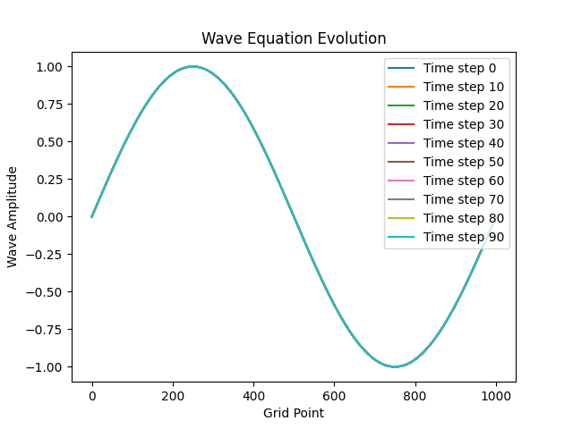
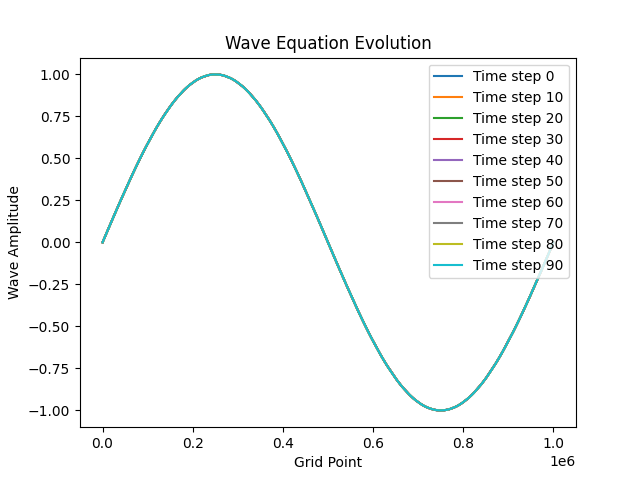
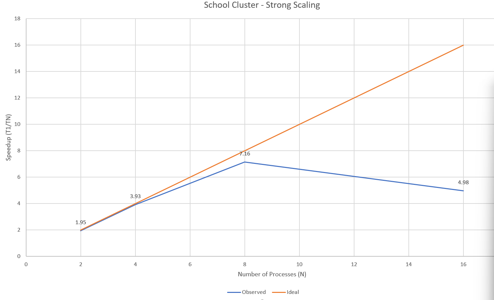
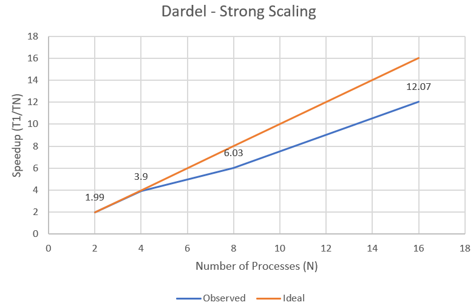
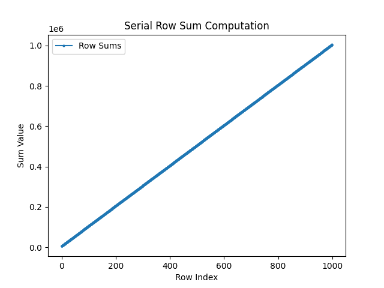
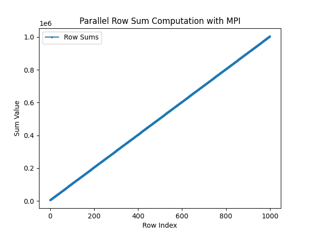
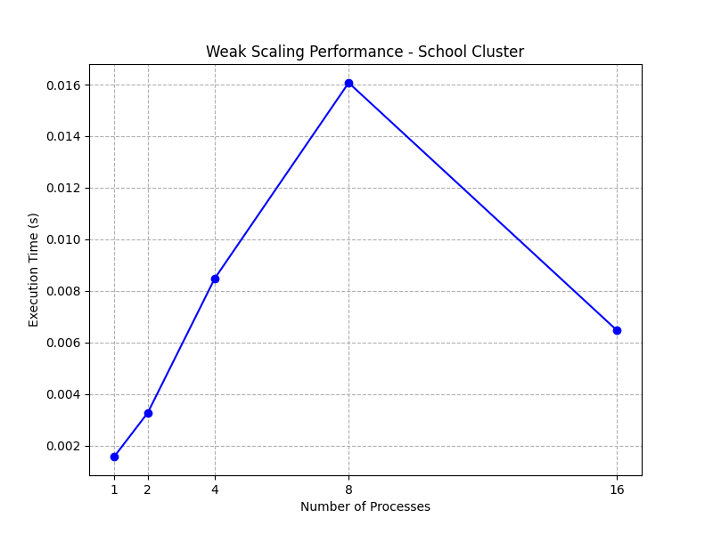
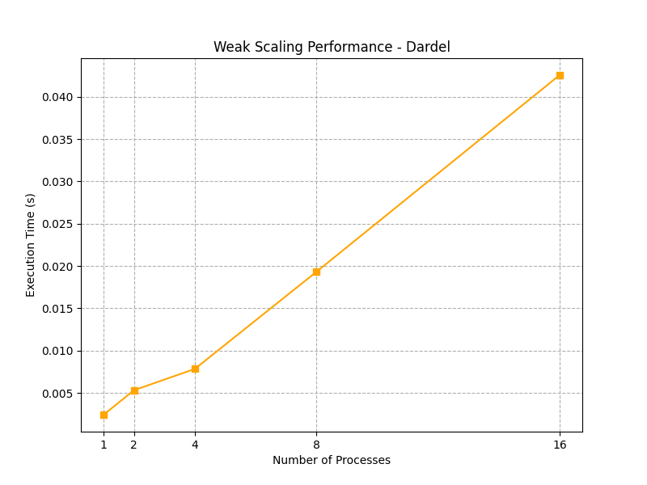

# Exercise 1: 1D Halo Exchange in a Wave Equation Simulation

## Parallelization Strategy:

To parallelize the code, at each step, each process will take one part of the 1D array to compute the next values for, and will also update the previous and current arrays in its assigned section. This is done by using MPI_Scatter to have the root process (rank 0) send distinct portions of the original u and u_prev matrices to all processes to store in local arrays that they will perform their updates on. 

However, the computations for the next step rely on the value both preceding and suceeding it in the array, which means if we just send each section in isolation to processes, then for values on the left most boundary - they will not have the neccessary preceding value to perform the next step computation (and same for the right most boundary value). To combat this, we use a halo exchange, where we have processes communicate with each other to retrieve thses neccessary values before going forwar with computation on their section. 

We do this by having the local arrays have a buffer of 1 index on both sides, and using MPI_Sendrecv to have processes send their boundary values to their neighbor processes (the process with rank one lower and one higher than the sending process), and in this way we populate each process with the neccessary boundary values to perform their computation. We only need to check for the process with rank 0 and rank (number of processes - 1) as they cannot send their left and right most boundary values to another process. 

For verification purposes, we then have a gather to update the global arrays at every 10th step by then reducing all of the local sections (ignoring each local halo values at the boundaries of the local arrays) back into the current main array. From the output files written at every 10th step, we are able to visualize the wave simulation and compare the sequential and parallel versions to verify that the program execution is not altered.

## Verification

Sequential: 

Parallel: 

We can see that the visualization for running the two different versions of this program with the same parameters gives the same visualization, showing that the computation is not affected by our parallelization, and the parallel implementation is correct. With the verification of the correctness of the code, when evaluating, we remove the I/O at every 10th step to properly measure scalability, as well as increase our grid size dramatically (from 1000 to 1000000) and the number of steps (from 100 to 10000).

## School Cluster Evaluation

To compile the code on the school cluster: 

```
mpicc -o parallel_halo parallel_halo.c -lm
```

To run the code on the school cluster with a certain number of processes: 

```
mpirun -np {N} ./parallel_halo
```

Runtime:
| Processes | Time (s) |
|---------|----------|
| 1       | 39.146   |
| 2       | 20.05    |
| 4       | 9.96     |
| 8       | 5.47     |
| 16      | 7.86     |


Strong Scaling: 

We can see that the strong scaling performs very well on the school cluster, even when compared to the ideal. From processes 2-8, the strong scaling nears the linear improvement of the ideal, which shows that the parallel version of the code reaches near full capability. However, we notice a signficant performance drop at 16 processes, both in the strong scaling, and in the actual runtime taking longer than at 8 processes. This may be due to the halo exchange now requiring much more communication at 16 processes to exchange boundary values, which may now overwhelm the added parallelization benefits of segmenting the array into smaller sections for each process. On a larger array, 16 processes may still provide added performance benefit as the computation of the process may not be under saturated with too small a section for the communication costs.

## Dardel Evaluation

To compile the code on dardel: 

```
cc -o parallel_halo parallel_halo.c -lm
```

To run the code on dardel we used a batch job shell script, to run with a certain number of processes P, adjust the --ntasks-per-node to P and the srun command to have -n {P}. To schedule our job on dardel we simply do sbatch {job shell file}

Our job file:

```
#!/bin/bash
#SBATCH --job-name=mpi_parallel_halo
#SBATCH --time=00:10:00
#SBATCH --nodes=1
#SBATCH --ntasks-per-node=16
#SBATCH --partition=main
#SBATCH --account=edu26.dd2356
#SBATCH -e error_file.e


# Load necessary modules (adjust based on Dardel's actual modules)
# module load PDC/23.03
# module load openmpi

srun -n 16 ./parallel_halo
```


Runtime:
| Processes | Time (s) |
|---------|----------|
| 1       | 63.13    |
| 2       | 31.70    |
| 4       | 16.17    |
| 8       | 10.02    |
| 16      | 5.23     |

Strong Scaling: 

We can see that the strong scaling also performs very well on Dardel, acheiving similar strong performance scaling nearing the ideal linear strong scaling as we increase the process count. We notice a slighly more measurable dip in the strong scaling for 8 processes, as on the school cluster we had a speedup of 7.16 while on Dardel it is just 6.03. However we notice that unlike the school cluster the speedup increases continue on Dardel for 16 processes. On dardel, the speedup from 8 to 16 nearly doubles - which is the ideal possible improvement, while the school cluster had the speedup take a signifcant drop. Despite the raw execution time taking longer on Dardel for process counts of 1-8, we can achieve our minimum execution time across all runs on both systems with a process count of 16 on Dardel, with the strong scaling still imrpvoing at a close to ideal rate. Further performance improvements are possible on Dardel with higher process counts or on larger scale problem sizes. Overall, the scalability of the parallel code extends further on Dardel than the school cluster.

### ScoreP Evaluation: 

To be able to run score-P tracing on our parallel_halo code, we had to do some additional setup, namely after compiling the original .c code, running:

```
pat_build -g mpi -o parallel_halo_trace ./parallel_halo 
```

This is to be able to run the executable while collecting the Score-P performance data of the execution. Afterwards, a directory is created to hold the performance reports, where to observe the relevant results we run: 

```
pat_report -O mpi_callers ./parallel_halo_trace+*/xf-files

pat_report -O profile ./parallel_halo_trace+*/xf-files
```

When checking the normal output job file, we noticed a similar ~5 seconds runtime when running with performance tracing, showing that the execution itself was not impacted in any way by the performance tracking and that the results are accurate for a normal execution of the parallel code.

For the mpi_callers report, the relevant section is:

```
Table 1: MPI Message Stats by Caller

MPI | MPI Msg | MPI Msg | MsgSz | 64KiB<= | Function
Msg | Bytes | Count | <16 | MsgSz | Caller
Bytes% | | | Count | <1MiB | PE=[mmm]
| | | | Count |

100.0% | 1,150,000.0 | 18,752.0 | 18,750.0 | 2.0 | Total
|--------------------------------------------------------------------
| 87.0% | 1,000,000.0 | 2.0 | 0.0 | 2.0 | MPI_Scatter
| | | | | | main
|||------------------------------------------------------------------
3|| 87.0% | 1,000,000.0 | 2.0 | 0.0 | 2.0 | pe.0
3|| 87.0% | 1,000,000.0 | 2.0 | 0.0 | 2.0 | pe.8
3|| 87.0% | 1,000,000.0 | 2.0 | 0.0 | 2.0 | pe.15
|||==================================================================
| 13.0% | 150,000.0 | 18,750.0 | 18,750.0 | 0.0 | MPI_Sendrecv
| | | | | | halo_exchange
3 | | | | | main
||||-----------------------------------------------------------------
4||| 13.9% | 160,000.0 | 20,000.0 | 20,000.0 | 0.0 | pe.1
4||| 13.9% | 160,000.0 | 20,000.0 | 20,000.0 | 0.0 | pe.9
4||| 7.0% | 80,000.0 | 10,000.0 | 10,000.0 | 0.0 | pe.15
|====================================================================
```

In total, on an execution with 16 processes, we make 18,752 MPI calls throughout. We can see from the table, that we have only 2 MPI_Scatter calls, which aligns with our program as MPI_Scatter is only done by the root process with rank 0, and is done once for the two global arrays (u and u_prev). The rest of the 18,750 calls done are MPI_Sendrecv calls that are made during the halo exchanges between processes (we have no MPI_Gather calls since we removed the I/O during performance evaluation).


For the profile report, the relevant section is: 

```
Table 1: Profile by Function Group and Function

Time% | Time | Imb. | Imb. | Calls | Group
| | Time | Time% | | Function
| | | | | PE=HIDE

100.0% | 4.997868 | -- | -- | 18,767.0 | Total
|--------------------------------------------------------------
| 79.2% | 3.958183 | 0.883247 | 19.5% | 1.0 | USER
||-------------------------------------------------------------
|| 79.2% | 3.958183 | 0.883247 | 19.5% | 1.0 | main
||=============================================================
| 20.4% | 1.021526 | -- | -- | 18,760.0 | MPI
||-------------------------------------------------------------
|| 20.1% | 1.006466 | 0.094513 | 9.2% | 18,750.0 | MPI_Sendrecv
|==============================================================
```

From the table, we can see that from the ~5 seconds (4.997) total execution time, around 1.02 seconds is spent on MPI calls, with the rest of the time spent elsewhere. With the vast majority of the MPI calls being MPI_Sendrecv, it makes sense that an overwhelming portion of the time spent during MPI calls is on MPI_Sendrecv (~1 of the 1.02 seconds). The two MPI_Scatter calls do make up a larger proportion of the total MPI call time than the total MPI calls made, and this may be due to MPI_Scatter being a much more complicated communication operation than a simpler MPI_Sendrecv.

# Exercise 2: MPI Matrix Parallelization

## Parallelization Strategy

The matrix row-summation program is parallelized using MPI collective communications through the following steps:

1. **Data Distribution (`MPI_Scatter`):** The root process (rank 0) initializes the $N \times N$ matrix and uses `MPI_Scatter` to evenly distribute blocks of contiguous rows to all participating MPI processes. Each process receives a sub-matrix of size `(N / size) x N`.
2. **Local Computation:** Each process independently calculates the sum of each row in its assigned sub-matrix, storing the results in a local array (`local_row_sums`). It also computes a `local_total_sum` for its block.
3. **Data Collection (`MPI_Gather`):** Once local computations are complete, `MPI_Gather` is utilized to collect all the `local_row_sums` arrays from every process back into the full `row_sums` array on the root process.
4. **Global Reduction (`MPI_Reduce`):** The `local_total_sum` computed by each process is aggregated using `MPI_Reduce` with the `MPI_SUM` operation. The root process receives the final `global_total_sum` of all matrix elements.
5. **Synchronization and Benchmarking:** `MPI_Barrier` is called right before and after the computation phase to synchronize all processes. `MPI_Wtime()` is used to measure the execution time of the parallelized section accurately.

## Validation

To validate the correctness of the parallel implementation, we compared the outputs of both the serial and parallel versions. Both programs compute the sum of each row and output the results to a text file. A direct comparison of the generated output files shows 0 differences, confirming that the parallel MPI implementation produces exactly the same numerical results as the original serial version.

### Visualizations

The following plots visualize the row sums computed by the serial and parallel versions, confirming their identical output:

**Serial Implementation:**


**Parallel MPI Implementation:**


## Performance Scaling Evaluation

### 1. School Cluster Analysis

**Weak Scaling Plot:**


**Commands used:**
To achieve weak scaling, the matrix size $N$ was dynamically passed to the compiler to ensure constant work per process ($N = 1000 \times \sqrt{P}$). The code was compiled and executed using the following bash commands for each process count $P$:
```bash
mpicc -O3 hw4-mpi-coll-TBC-new.c -o parallel_scaling -DN=$N
mpirun -np $P ./parallel_scaling
```

```bash
Processes | Matrix Size (N) | Runtime (s)
-----------------------------------------
        1 |            1000 | 0.001574
        2 |            1414 | 0.003270
        4 |            2000 | 0.008479
        8 |            2832 | 0.016070
       16 |            4000 | 0.006481
```

**Analysis:**
In an ideal weak scaling scenario (constant work per process), the runtime should remain completely flat. Instead, the runtime increases significantly from 1 to 8 processes (0.0015s to 0.016s). This poor scaling efficiency occurs because the mathematical computation is exceptionally fast, causing the execution time to be completely dominated by the overhead of MPI collective communications (`MPI_Scatter`, `MPI_Gather`, `MPI_Reduce`).
Interestingly, at 16 processes, the execution time drops to 0.0064s. This is likely due to beneficial cache effects; as the total matrix size reaches $4000 \times 4000$, the 16 processes split the data into much smaller, cache-friendly row chunks (250 rows each), yielding a computational speedup that partially offsets the communication overhead.

### 2. Dardel Cluster Analysis

**Weak Scaling Plot:**


**Commands used:**
The job was submitted using a Slurm batch script (`sbatch dardel_weak_scaling.sh`) configured with `--ntasks-per-node=4`. Inside the script, the code was compiled with the standard Cray compiler wrapper and executed using `srun`:
```bash
cc -O3 hw4-mpi-coll-TBC-new.c -o parallel_scaling -DN=$N
srun -n $P ./parallel_scaling
```

```bash
Processes | Matrix Size (N) | Runtime (s)
-----------------------------------------
        1 |            1000 | 0.002424
        2 |            1414 | 0.005317
        4 |            2000 | 0.007833
        8 |            2832 | 0.019309
       16 |            4000 | 0.042556
```

**Analysis:**
The weak scaling on Dardel shows a consistent and steep increase in runtime from 0.0024s (1 process) to 0.0425s (16 processes). Since we limited the processes to 4 per node (`--ntasks-per-node=4`), the 16-process job was forced to execute across 4 distinct physical nodes. The sharp increase in time—especially when jumping from 2 nodes (8 processes) to 4 nodes (16 processes)—is caused by the heavy inter-node communication penalty over the network. Network communication is significantly slower than intra-node shared memory communication, severely exacerbating the overhead of the MPI collectives.

### Profiling Evaluation

To investigate the poor weak scaling performance on Dardel and find the actual bottleneck, we instrumented the code using Cray Perftools at 16 processes. The following commands were used to compile, instrument, execute, and generate the profiling reports:

```bash
module load perftools-base
module load perftools
cc -O3 hw4-mpi-coll-TBC-new.c -o parallel_scaling -DN=4000
pat_build -g mpi -o parallel_scaling_trace parallel_scaling
srun -n 16 ./parallel_scaling_trace
pat_report -O mpi_callers ./parallel_scaling_trace+*/xf-files > mpi_report.txt
pat_report -O profile ./parallel_scaling_trace+*/xf-files > time_report.txt
```

**MPI Message Stats by Caller (from `mpi_callers` report):**
```text
Table 1:  MPI Message Stats by Caller

    MPI |     MPI Msg |   MPI | MsgSz | 256<= | 1MiB<= | Function
    Msg |       Bytes |   Msg |   <16 | MsgSz |  MsgSz |  Caller
 Bytes% |             | Count | Count | <4KiB | <16MiB |   PE=[mmm]
        |             |       |       | Count |  Count | 
       
 100.0% | 8,002,008.0 |   3.0 |   1.0 |   1.0 |    1.0 | Total
|-------------------------------------------------------------------
| 100.0%| 8,000,000.0 |   1.0 |   0.0 |   0.0 |    1.0 | MPI_Scatter
```

From the MPI callers table, we see that exactly 100% of the MPI Message bytes (8 MB) are attributed to the `MPI_Scatter` operation. Because we are scattering a large $4000 \times 4000$ matrix (at 16 processes) to all nodes, the data distribution creates a massive communication payload over the network. 

**Profile by Function (from `time_report` report):**
```text
Table 1:  Profile by Function Group and Function

  Time% |     Time | Calls | Group / Function
        |          |       |   
 100.0% | 0.062364 |  19.0 | Total
|-----------------------------------------------------------------
|  64.1% | 0.039964 |  11.0 | MPI
||  63.9% | 0.039842 |   1.0 | MPI_Scatter
|=================================================================
|  32.3% | 0.020137 |   7.0 | MPI_SYNC
||  21.6% | 0.013452 |   2.0 | MPI_Barrier(sync)
||   6.5% | 0.004058 |   1.0 | MPI_Finalize(sync)
||   3.2% | 0.001985 |   1.0 | MPI_Gather(sync)
|=================================================================
|   3.6% | 0.002263 |   1.0 | USER
||   3.6% | 0.002263 |   1.0 | main
```

The time profile strongly supports our hypothesis regarding the scaling performance drop. Out of the total execution time recorded by the profiler:
1. **MPI Communication (`MPI_Scatter`):** Takes up roughly **64%** of the entire execution time. Sending the large matrix chunks to different nodes across the network is the primary bottleneck.
2. **MPI Synchronization:** Takes up **32.3%** of the time, primarily waiting at `MPI_Barrier` and `MPI_Gather`.
3. **Actual Computation (`USER/main`):** The mathematical computation (calculating the row sums) takes an astonishingly small **3.6%** of the execution time (0.0022 seconds). 

**Conclusion:** 
The profiling data conclusively shows that this parallelized matrix row-summation program is heavily communication-bound. Nearly 96% of the program's runtime is spent distributing data, waiting for synchronization, and collecting results, while less than 4% is spent doing actual mathematics. This fully explains why our weak scaling efficiency dropped as we added more processes across different nodes.

# Exercise 3: 2D Game of Life with MPI and Non-Blocking Communication

Conway’s Game of Life is a cellular automaton with simple rules leading to complex behaviors. Your task is to parallelize the Game of Life using MPI with 2D ghost cell exchange and non-blocking communication.

## Running
A little tldr for running
### Serial

```bash
gcc hw4-mpi-gameoflife-TBC_serial.c -o serial.out -DWRITE_OUTPUT
./serial.out
```

```bash
mpicc hw4-mpi-gameoflife-TBC_mpi.c -o mpi.out -DWRITE_OUTPUT
mpirun -np <num_threads> mpi.out
```

Afterwards, for a nice visualization, run 
```bash
python viz.py
```
And modify:
```python
# files = sorted(glob.glob("output_text/output_serial/gol_output_*.txt"))
files = sorted(glob.glob("output_text/output_mpi/gol_output_*.txt"))
```
By commenting and decommenting the place to take files from

- ## Parallelize the serial code using MPI based on the serial version here Download the serial version here:
  the code for this exercise can be seen inside the `hw4-mpi-gameoflife-TBC_mpi.c` file. Over there, paralelization for the opdate function was done
  - ### Decompose the 2D grid into subdomains assigned to MPI processes.
  The decomposition was done so that each process would get a certain number of rows. Initially, there are `N` rows. Each process will receive `N / nr_proc` rows. With these rows, we will attach 2 more rows, which are called ghost_rows. These rows will be holding the information gotten by the processes above and under.
  ```c
  void initialize_subarray(int world_size) {
    // initialize data for every vector
    // Take into consideration the ghost cells
    sub_grid = (int*)malloc((N/world_size + 2) * N * sizeof(int));
    sub_grid_new = (int*)malloc((N/world_size + 2) * N * sizeof(int));
  }
  ```
  - ### Use MPI_Isend and MPI_Irecv for non-blocking ghost cell exchange.
  For this, we are `rascals`, hence we are first sending the data for each process to their neighboring ones
  ```c
  MPI_Isend(sub_grid + N, N, MPI_INT, (rank + world_size - 1) % world_size, 0, MPI_COMM_WORLD, &req[0]);
  // send to the lower guys the lower ghost
  MPI_Isend(sub_grid + N * (N/world_size), N, MPI_INT, (rank + world_size + 1) % world_size, 1, MPI_COMM_WORLD, &req[2]);
  ```
  Afterwards, each process is doing their computation on the sub_grid. (as it doesn't depend on the rows above and beyond):
  ```c
  for (int i = 2; i < N / world_size; i++)
  ```
  And afterwards, each process waits for the messages from their neighbors to arrive:
  ```c
  // receive from the upper guy it's lower ghost
  MPI_Irecv(sub_grid, N, MPI_INT, (rank + world_size - 1) % world_size, 1, MPI_COMM_WORLD, &req[1]);
  // receive from lower guy it's higher ghost
  MPI_Irecv(sub_grid + N * (N/world_size) + N, N, MPI_INT, (rank + world_size + 1) % world_size, 0, MPI_COMM_WORLD, &req[3]);
  ```
  After this data arrives, each process does the grid computation for it's first and last rows:
  ```c
  // now that we have the boundaries, we can compute the upper place
  update_row(1, world_size);
  // now that we have the boundaries, we can compute the and lower place
  update_row(N / world_size, world_size);
  ```
  - ### In the report, briefly describe your parallelization strategy.
  Our paralelization strategy was composed of dividing the matrix into P subsections, assigning each process one. Each process shares the piece of data that is being used by other processes as well at the beginning of an iteration, afterwards starts working on it's parts of data that don't require information owned by other processes. After it finishes, it looks inside it's buffer to see if the data that is required arrived. Afterwards, it uses that data in order to update the first and last rows (as the data there is using data from other processes).
- ## Update cell states based on Conway’s rules:
  - ### A live cell with fewer than two or more than three neighbors dies.
  Already done on the serial version
  - ### A dead cell with exactly three neighbors becomes alive.
  ALready done on the serial version
- ## Visualize the results with Python.
  - ### In the report, present the visualization and validate the correctness of your implementation.
  The correctness (although we are using Wait intrinsic), is done by comparing the output_text/output_serial/gol_output_99.txt with output_text/output_mpi/gol_output_99.txt. If these 2 files are identical (as we are using the same srand seed), that means that the code worked and the paralelization is fine.
  There is even a script for running both of them and checking with diff! Cause we are very nice guys!
  ```bash
  chmod +x run_everything_and_vibe.sh
  ./run_everything_and_vibe.sh
  ```
- ## Analyze the parallel efficiency (on the school cluster) at increased number of processes. Hint: You may want to increase the problem size (N) and the number of steps for better scalability. You may also want to disable the I/O for measuring scalability. 
  The visualization is already deactivated by not inputing the `-DWRITE_OUTPUT` flag. The N is `2000` and the step is `300`. 

  Speedup:

  S_p = T_1mpi / T_p

  Parallel efficiency:

  E_p = S_p / p = T_1mpi / (p * T_p)

  Using the MPI 1-process runtime T_1mpi = 32.036022 s as baseline.
  - Serial 1 process: 34.904984 s. 
  - MPI 1 process: T_1mpi = 32.036022 s, S_1mpi = 1.0000, E_1mpi = 1.0000
  - MPI 2 processes: T_2 = 16.175000 s, S_2 = 32.036022 / 16.175000 ≈ 1.9810, E_2 ≈ 0.9905
  - MPI 4 processes: T_4 = 7.956181 s, S_4 = 32.036022 / 7.956181 ≈ 4.0266, E_4 ≈ 1.0066
  - MPI 8 processes: T_8 = 4.129033 s, S_8 = 32.036022 / 4.129033 ≈ 7.7565, E_8 ≈ 0.9696
  - MPI 16 processes: T_16 = 2.170670 s, S_16 = 32.036022 / 2.170670 ≈ 14.7587, E_16 ≈ 0.9224
  - MPI 32 processes: T_32 = 1.658731 s, S_32 = 32.036022 / 1.658731 ≈ 19.3136, E_32 ≈ 0.6036
  - MPI 64 processes: T_64 = 3.299068 s, S_64 = 32.036022 / 3.299068 ≈ 9.7100, E_64 ≈ 0.1517

  We have superlinear scaling for the number of processes being 4. This is AMAZING. It means that the matirx *N (2K elements * 2k elements)* was getting out of multiple layers of memory, hence, by dividing it to multiple threads, they can keep it closer to memory, and hence the superlinear scaling.
  Other than that, it seems that there was enough computation that the overhead of sending data is not that relevant.
  The L1 cache is 32KB *(32 * 1024 / 2048 = 16)*. That would mean that 16 rows would fit nicelly in the L1 cahce. 
  The L2 cache is 2048KB (rough approximation). This means that inside it would fit the whole N matrix.
  These results would mean that we would get superscaling even while having 128 processes. The overhead of stopping the computation and sending and receiving data is too much tho.
  At the same time, the L2 cache that can hypothetically hold the whole N matrix is good. We have 2 matrices (the 2 grids), so the L2 cache would need to fit 2 times that, plus some extra memory for other variables. So, for having 2 processes , and dividing the memory by 2 is still not giving superlinear. But dividing and sharing the memory to 4 processes means that we will have the perfect amount for L2 cache, and look, BOOOOMM superlinear.

  ## GPT usage
  I asked and threatened Copilot to compute himself the speedup and efficiency (I only gave it the times and told it to do the division). We are heating up the planet because I were too lazy to use my laptop calculator.
  I also talked with claude to see if there is a way to send the data without having any blocking behaviour. Just to double check.

